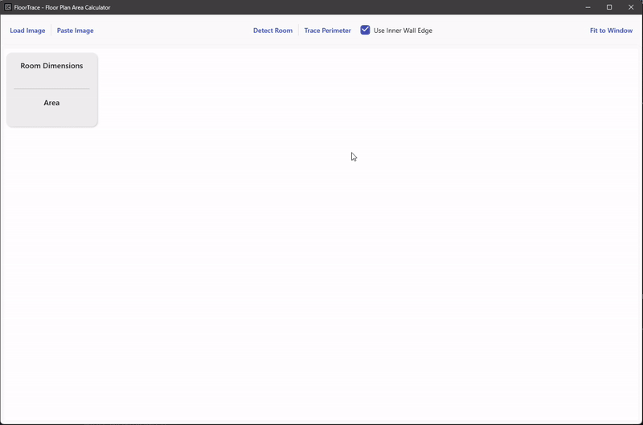

# FloorTrace v1.0.0-alpha - Initial Public Release



## 🎉 First Alpha Release

This is the first public alpha release of FloorTrace - a Windows application that automatically calculates the square footage of hand-drawn floor plan sketches using advanced computer vision algorithms.

## ⚠️ Alpha Software Disclaimer

**This is alpha software.** While functional, it may contain bugs and is not recommended for production use. Please report any issues you encounter on our [Issues page](https://github.com/PairedSales/FloorTrace-Public/issues).

## 📥 Download & Installation

### System Requirements
- **OS**: Windows 10/11 (64-bit)
- **Runtime**: .NET 8.0 Desktop Runtime
- **RAM**: 4GB minimum (8GB recommended)
- **Storage**: 100MB free space

### Installation Steps

1. **Install .NET 8.0 Desktop Runtime** (if not already installed):
   - Download: https://dotnet.microsoft.com/download/dotnet/8.0/runtime
   - Direct link: [.NET 8.0 Desktop Runtime x64](https://dotnet.microsoft.com/en-us/download/dotnet/thank-you/runtime-desktop-8.0.11-windows-x64-installer)
   - Size: ~50 MB (one-time installation)

2. **Download FloorTrace**:
   - Download `FloorTrace-v1.0.0-alpha-win-x64.zip` below (47 MB)

3. **Extract and Run**:
   - Extract the ZIP file to your desired location
   - Double-click `FloorTrace.exe`
   - See `INSTALLATION.txt` in the ZIP for detailed instructions

> **Note**: If .NET 8.0 is not installed, Windows will automatically prompt you to download it when you try to run FloorTrace.exe

## 🚀 Key Features

### Core Functionality
- 📸 **Image Loading** - Support for JPG, PNG, BMP, TIF, TIFF, and WebP formats
- 🔍 **Automatic Dimension Detection** - OCR-based room dimension recognition
- 📏 **Scale Calculation** - Automatic scale calculation from detected dimensions
- ✏️ **Manual Adjustments** - Edit detected room dimensions with real-time updates
- 🖊️ **Automatic Perimeter Tracing** - Advanced edge detection with inner/outer wall options
- 📐 **Area Calculation** - Precise square footage using Green's theorem

### User Experience
- 🎯 **Zoom-to-Point** - Mouse wheel zoom centered on cursor
- 🔄 **Real-time Updates** - Automatic recalculation when parameters change
- 🖱️ **Interactive Editing** - Drag points, double-click to add, right-click to remove
- ⌨️ **Keyboard Shortcuts** - Ctrl+O (load), Ctrl+V (paste), mouse wheel zoom

## 🎯 Quick Start Guide

1. **Launch FloorTrace**
2. **Load Image**: Press `Ctrl+O` or click "Load Image" (or paste with `Ctrl+V`)
3. **Detect Room**: Click "Detect Room" to find dimensions automatically
4. **Trace Perimeter**: Click "Trace Perimeter" to outline the floor plan
5. **View Results**: Area is calculated and displayed automatically

See the included `README.md` for comprehensive documentation.

## 📊 Supported Image Formats

- JPG/JPEG
- PNG
- BMP
- TIF/TIFF
- WebP

## 🐛 Known Issues

- Single room detection only (multi-room support planned for future releases)
- Some edge cases in perimeter detection may require manual adjustment
- Large images (>10MB) may process slowly
- Dimension parsing works best with clear, readable text

## 🔮 Planned Features

- Multiple room selection and analysis
- Measurement annotation tools
- Multi-floor support
- Export functionality (PDF, CAD formats)
- Batch processing of multiple floor plans
- Advanced OCR improvements
- 3D visualization capabilities

## 🛠️ Technical Highlights

- **.NET 8.0** - Modern, cross-platform runtime
- **WPF** - Rich desktop user interface
- **OpenCV** - Computer vision and image processing
- **SkiaSharp** - Advanced graphics rendering
- **MVVM Architecture** - Clean separation of concerns
- **Dependency Injection** - Modular, testable design

## 📞 Support & Feedback

### Reporting Issues

1. Check the logs in `%LOCALAPPDATA%/FloorTrace/Logs/`
2. Create an issue on [GitHub Issues](https://github.com/PairedSales/FloorTrace-Public/issues)
3. Include:
   - Description of the problem
   - Steps to reproduce
   - Log file contents (if applicable)
   - System information (Windows version, .NET version)

### Getting Help

- Check the [README.md](https://github.com/PairedSales/FloorTrace-Public/blob/fresh-start/README.md) for detailed documentation
- Review the troubleshooting section in the README
- Open an issue for feature requests or bug reports

## 🏗️ Development

### Building from Source

```bash
git clone https://github.com/PairedSales/FloorTrace-Public.git
cd FloorTrace-Public
git checkout fresh-start
dotnet restore
dotnet build
dotnet run
```

### Running Tests

```bash
dotnet test FloorTrace.Tests/
```

See [CONTRIBUTING.md](https://github.com/PairedSales/FloorTrace-Public/blob/fresh-start/CONTRIBUTING.md) for contribution guidelines.

## 📄 License

This project is licensed under the MIT License - see the [LICENSE](https://github.com/PairedSales/FloorTrace-Public/blob/fresh-start/LICENSE) file for details.

## 🙏 Acknowledgments

- **OpenCV** - Computer vision and image processing
- **SkiaSharp** - Advanced graphics rendering
- **CommunityToolkit.Mvvm** - MVVM framework
- **Serilog** - Structured logging

---

**Version**: 1.0.0-alpha  
**Release Date**: October 2025  
**Branch**: fresh-start  
**Repository**: [FloorTrace-Public](https://github.com/PairedSales/FloorTrace-Public)

Thank you for testing FloorTrace! Your feedback helps make this tool better for everyone. 🚀